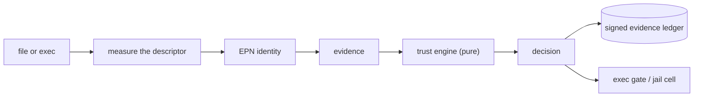

# JLR

**JLR is a security-governance layer for Linux.** It decides, continuously and on its own, what software may run and with
what authority; keeps a signed, tamper-evident record of every decision; confines what it lets run under restriction; and
can boot independently of the system it governs so that it stays understandable, verifiable and recoverable when the host
is not.

It is meant to be nearly invisible: almost everything it does needs no answer from the person using the machine. It is
more than an antivirus, because it works from identity, provenance and policy and does not guess about behaviour; and more
than disk encryption, because confidentiality at rest is one property among many.

> **Design principle:** the host may fail. JLR must remain understandable, verifiable and recoverable.

## Status

**A working, tested prototype (pre-release).** About 15,000 lines of Rust, 190+ tests, including tests that boot the real
initramfs under QEMU/KVM and run the exec gate as root in a guest. It has not been externally audited, and nothing here is a
claim that a machine is protected until the limits in [docs/SECURITY_BOUNDARIES.md](docs/SECURITY_BOUNDARIES.md) are read.

| Works today | Designed, not built |
|---|---|
| Content-addressed artifact identity (EPN), deterministic CBOR, signed envelopes | Firmware/TPM authentication of the boot chain |
| Deterministic trust engine with validated, signed policy; revocation, approvals, baselines | Package-manager hook for honest silent admission of updates |
| Descriptor-based measurement; dpkg evidence | Recovery tools for damaged hosts; installer; host handoff |
| Jail cells (namespaces, private root, seccomp, Landlock, dropped capabilities) that run a sealed copy of the measured bytes and report what they enforced | Behaviour observation and an allow-list profile |
| Merkle evidence ledger with signed checkpoints | VM-backed cells; cross-view comparison |
| Verified boot: signed releases, A/B slots, rollback floor, RAM-resident base, reproducible images | Hybrid post-quantum signatures; fleet policy |
| `jlrd`: fanotify exec gate (audit, then enforce), rescan | Desktop notifications, portals |

## Try it

```sh
cargo build --release
export PATH="$PWD/target/release:$PATH"

jlr doctor                       # what can this machine enforce? runs a live test cell
jlr init                         # keys, signed policy, evidence ledger (in ~/.local/state/jlr)
jlr scan /usr/bin                # measure and classify; unknown software becomes OBSERVED
jlr explain /usr/bin/sudo        # why it is quarantined, with the evidence
jlr baseline enroll /usr/bin     # your signed statement that this is the initial state
jlr run ~/Downloads/tool         # runs confined: no network, no home, no devices
jlr ledger verify                # every signature, link and checkpoint
```

```text
$ jlr run /tmp/jlr-demo/mytool
uid=0(root) gid=0(root) groups=0(root),65534(nogroup)
jlr: OBSERVED in CELL-0 network=NONE basis=NONE reasons=DEFAULT_TIER enforcement=Partial unavailable=[cgroup: memory.max: Permission denied]
```

The report says `Partial` because this session has no delegated cgroup: **missing enforcement is named, never hidden.**

To boot the verified chain in a VM (needs QEMU, a kernel with virtio/ext4/squashfs built in, and `mksquashfs`; see
[docs/DEVELOPMENT.md](docs/DEVELOPMENT.md)):

```sh
boot/build.sh                                        # reproducible signed base image + initramfs
JLR_BOOT_SHOW=1 cargo test -p jlr-boot --test qemu -- --nocapture
```

## How it works



Every artifact gets an **EPN** (*Encryption Protocol Number*): a public, content-addressed identifier, the SHA-256 of a
canonical record. A **pure function** of the signed policy and the evidence returns a state, a cell, a network mode and an
exact capability set. Revocation always wins; missing evidence never promotes. Every state change is a signed ledger event
that says whether its basis was cryptographic, policy, or a human override. Software that may not run normally runs, if at
all, in an isolated cell built from the decision, and the launcher refuses to start anything whose mandatory
controls cannot be established.

Read [docs/OVERVIEW.md](docs/OVERVIEW.md) for the one-page version and [docs/ARCHITECTURE.md](docs/ARCHITECTURE.md) for the
design.

## Repository

```text
crates/   jlr-cbor  jlr-crypto  jlr-model  jlr-ledger  jlr-policy  jlr-measure  jlr-cell  jlr-engine  jlr  jlr-boot  jlrd
boot/     reproducible base image and initramfs build; guest test scripts
docs/     the design record; docs/generated and docs/vectors are produced from the code
tools/    documentation generator and an independent protocol-vector checker
contrib/  systemd unit
```

## Documentation

Start with the [documentation index](docs/README.md). Highlights:

- [Overview](docs/OVERVIEW.md) · [Architecture](docs/ARCHITECTURE.md) · [Trust model](docs/TRUST_MODEL.md)
- [Integrity protocol](docs/INTEGRITY_PROTOCOL.md) (wire formats, with [test vectors](docs/vectors/protocol-v1.json))
- [Software admission](docs/SOFTWARE_ADMISSION.md) · [Jail model](docs/JAIL_MODEL.md) · [Boot and installation](docs/BOOT_INSTALLATION.md) · [Recovery](docs/RECOVERY.md)
- [Threat model](docs/THREAT_MODEL.md) · [Security invariants](docs/SECURITY_INVARIANTS.md) · [Security boundaries and claims](docs/SECURITY_BOUNDARIES.md) · [Adversarial review record](docs/REVIEW_2026-09.md)
- [Operations](docs/OPERATIONS.md) · [Command reference](docs/CLI_REFERENCE.md) · [Development](docs/DEVELOPMENT.md)
- [Decisions](docs/DECISIONS.md) · [Roadmap](docs/IMPLEMENTATION_ROADMAP.md) · [Glossary](docs/GLOSSARY.md) · [References](docs/REFERENCES.md)
- [Security policy](SECURITY.md) · [Contributing](CONTRIBUTING.md) · [Changelog](CHANGELOG.md)

## Security language

A hash proves equality to a chosen digest, not that an artifact is safe. A signature establishes a chain to a signer, not
that firmware or runtime memory is uncompromised. A sandbox constrains authority; it does not prove harmlessness. A snapshot
is recoverable only when a restore drill has succeeded. JLR reports the scope and freshness of its evidence instead of
claiming absolute integrity, and it does not call itself unhackable.

## License

GNU Affero General Public License v3.0. See [LICENSE](LICENSE).
