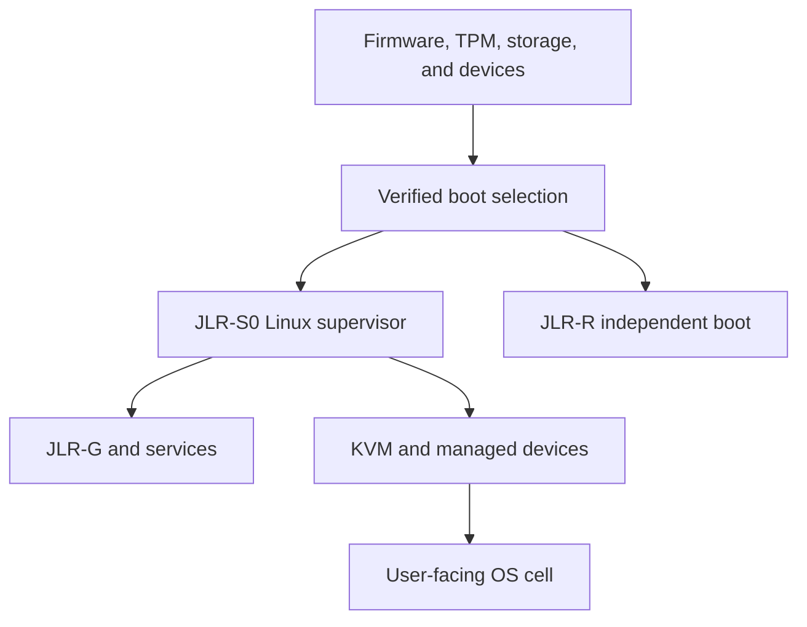

# Architecture and trust boundaries

**Status:** design target; none of these components is implemented in this repository.

## Goal and terminology

JLR provides non-interactive security governance for an ordinary, user-facing operating system and an independent file/system recovery path. In these documents, **machine** means physical hardware; **supervisor** means the JLR-S0 Linux kernel and userland; **workload** means the user-facing OS, initially a VM; and **recovery** means a separately bootable JLR-R environment. This vocabulary avoids calling the workload the security “host” when it is actually a guest.

The primary topology is:



Here KVM is part of the JLR-S0 kernel/VMM stack; it is not an independent layer below JLR-S0. A service running under the same kernel cannot guarantee the kernel's integrity. An external witness, an isolated management processor, or another separately enforced domain could later verify signed checkpoints without trusting the workload, but that design is outside the initial build.

## Non-negotiable invariants

1. **Recovery is boot independent.** JLR-R must boot without the workload kernel, its bootloader, its filesystem, or a network connection. A local recovery partition is useful for convenience; an independent boot medium is required to survive failure of the shared disk or boot path.
2. **Unknown state has less authority.** Missing measurements, stale attestations, conflicting observations, and policy failures block new privileged actions in the affected scope. They do not automatically erase data.
3. **The supervisor cannot mark itself verified by assertion.** Boot image verification anchors its initial state; subsequent runtime evidence is explicitly scoped. Full independence needs a separate verifier.
4. **Executable admission and data recovery differ.** A copied file can match its hash and still contain malicious code or data. Restored executables require fresh admission; recovered data is handled as untrusted input until validated for its use.
5. **Cloneable code, unique identity.** Profiles share an audited image, while each installed node generates its own keys and receives an authorized role manifest.
6. **No silent repair.** Destructive restore requires an explicit signed policy authorizing the action or deliberate local recovery authorization after a preview and preserved evidence.
7. **Evidence states its limits.** Every receipt names observations included, observations missing, boot identity, policy version, and the period in which it was collected.

## Responsibility and authority

| Component | Reads | Writes / controls | Trust boundary |
| --- | --- | --- | --- |
| Signed boot selector | Signed boot metadata | Selects A, B, or R | Subject to firmware and platform key configuration. |
| JLR-S0 | Its verified image, permitted devices, guest disk and VM events | Launches VM, controls virtual devices and ephemeral runtime | Compromise of its kernel or VMM can subvert local services. |
| JLR-G | Policy, manifests, boot result, evidence | Decisions, scoped leases, revocations | A separate process only; a distinct hardware domain is a future milestone. |
| JLR-RIME (outside guest) | VM boundary events, block/network observations | Evidence records and alerts | A view of exposed virtual hardware, not semantic certainty about guest processes. |
| JLR-RIME (inside guest) | Guest process, file, and privilege events | Signed reports to supervisor | Guest kernel and agent can lie or go offline; reports are never sufficient alone for host-enforcement claims. |
| JLR-PURIFY | Verified snapshots and manifests | Isolation and controlled restore | Destructive writes gated by explicit recovery authority. |
| JLR-R | Rescue media and damaged storage | Export or restore only after authorization | Never executes binaries from a suspect workload disk. |

### Scope of enforcement

At the VM boundary JLR-S0 can stop or start a cell, restrict its virtual network, snapshot or withhold its virtual disk, and withhold external keys it brokers. It cannot reliably infer every guest `exec`, `mprotect`, or credential change by watching block writes and packets alone. Guest-agent reports provide semantics; kernel hooks or finer-grained introspection require separate implementation and coverage testing. No document should say that *every* significant guest memory transition is observed or that a pulse always completes within a fixed number of milliseconds.

For a bare-metal companion installed into a general-purpose host, host root and kernel code are above the companion's effective protection. That mode is useful for research and backup preparation, but its receipts must say `assurance: companion` and its policy must not claim root-resistant isolation.

## Image and process layout

Woof-CE provides a starting build lineage and Puppy's RAM/initrd/SFS construction concepts. The released JLR image must be reproducible from pinned source, packages, patches, and toolchain versions. A compressed SFS is packaging; read-only mounting alone does not authenticate its contents. The design calls for a signed boot contract and integrity enforcement for the read-only core, with the chosen mechanism validated in the first milestones.

```text
Boot artifact: signed kernel + initrd + root descriptor + versioned manifest
Read-only:      supervisor base, core, policy baseline, recovery tooling
Writable RAM:   sockets, temporary evidence, short-lived material
Persistent:     append-only/checkpointed evidence and encrypted snapshot store
Guest:          separately provisioned virtual disk and device policy
```

S0 starts a small number of dedicated services: boot verification, Guardian/policy, VM control, event intake, key broker, ledger/snapshot manager, and recovery coordinator. Each service receives only the devices, file paths, capabilities, and IPC operations required. Production images omit a desktop, interactive package manager, default SSH, and persistent Puppy save layer. Service hardening and any emergency local access must be exercised under fault tests.

## Detection and response

JLR-RIME collects event-driven signals plus periodic scoped remeasurement. A **JIP** is a versioned integrity pulse receipt, not a promise that the whole machine has just been rehashed. A **SIR** summarizes measured state with explicit coverage. **XVD** compares guest and supervisor views when the same claim can be independently tested; disagreement may indicate compromise, sensor lag, or a modeling error and first produces `DEGRADED` until investigated.

Authority decisions are explicit: subject, operation, object, policy digest, validity interval, and evidence requirements. Statistical anomaly signals may prompt additional measurements and reversible restrictions. They do not by themselves justify data deletion, secret destruction, or a claim of malware detection.

The system states and cryptographic records are specified in [State and protocols](STATE-AND-PROTOCOLS.md). See [Threat model](THREAT-MODEL.md) for what these boundaries cannot defend against.
