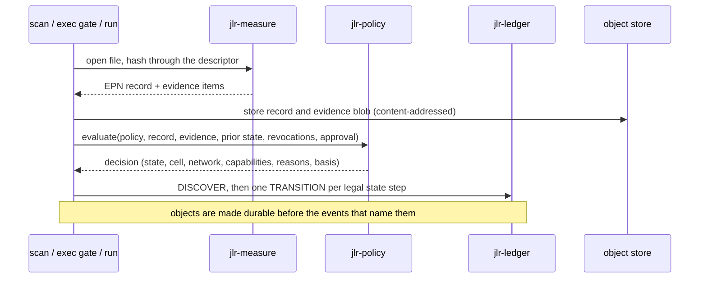
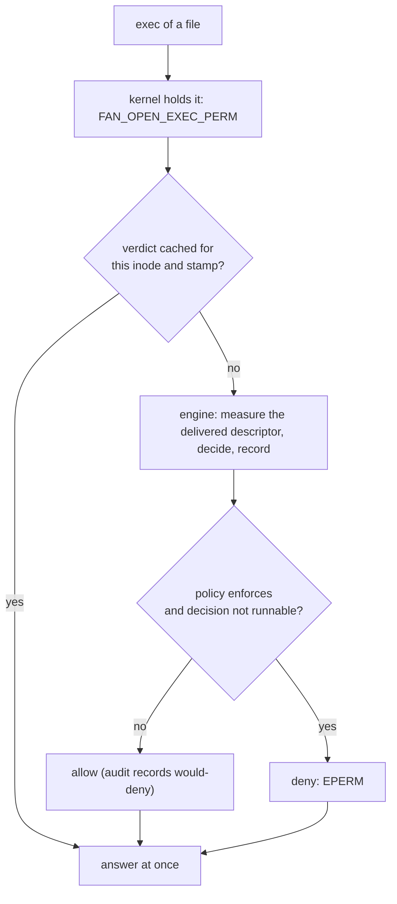
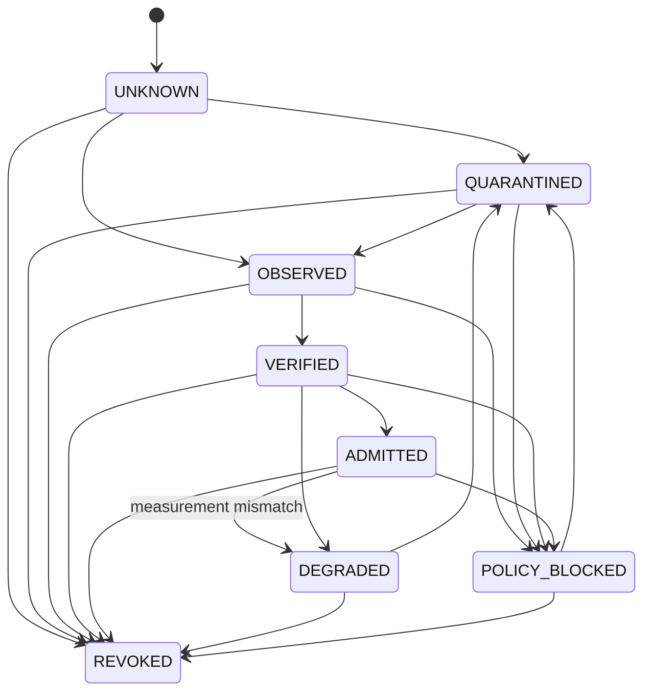

# JLR Architecture

**Status legend.** *Implemented*: code exists and is tested. *Prototype*: works, with limits stated in
[SECURITY_BOUNDARIES.md](SECURITY_BOUNDARIES.md). *Designed*: specified here, not built.

## 1. Purpose

JLR mediates trust between machine state, software artifacts and the operating system that runs them. It separates a
**governance plane**, which decides, records and enforces, from a **host plane**, which does general-purpose work. A host
compromise must not automatically become a compromise of JLR's boot artifacts, signed policy, recovery path or
historical evidence.

## 2. Deployment modes and how they stage

The same records, protocols and decision function serve every mode. What changes is the boundary the governance plane
sits behind, and therefore what a report may claim.

| Mode | Where JLR runs | Can honestly claim | Status |
|---|---|---|---|
| **companion** | Beside the host, on the host kernel | Decisions, evidence, confinement of software JLR launches, and an exec gate. Host root can subvert it | Implemented |
| **supervisor** | JLR boots first from verified media into a RAM-resident base and then starts the governed system | Verified base, monotonic rollback floor, evidence that starts from a measured state | Boot chain implemented and tested under QEMU; governing a host as a workload is designed |
| **recovery** | A separately booted rescue environment | Inspection of a damaged host read-only, export, verification of the ledger against off-machine checkpoints | Boot chain it needs exists; the tools are designed |
| **prototype** | Any of the above under an emulator | Only what the test showed | Used by the boot and gate tests |

The supervisor's host may be run *directly* (JLR-owned boot chain, host on the same kernel, governed by the exec gate
plus IPE/fs-verity when available) or, later, *as a KVM guest* for a stronger boundary. The choice is a deployment
property; nothing in the protocols depends on it. See [DECISIONS.md](DECISIONS.md) ADR-014.

## 3. Components

The names below are the final vocabulary. The right-hand column shows where the earlier design sets used a different name.

| Component | Crate | Responsibility | Earlier names | Status |
|---|---|---|---|---|
| Strict codec | `jlr-cbor` | One byte string per value; every parse is a strict parse | Canonical form | Implemented |
| Crypto and envelopes | `jlr-crypto` | Digests, Ed25519, key roles, signed envelopes bound to record type and node | Key roles | Implemented |
| Model | `jlr-model` | EPN records, admission states, capabilities, cells, evidence, decisions, events | EPN, states | Implemented |
| Ledger | `jlr-ledger` | Signed append-only events, Merkle tree, signed checkpoints, tail repair | Evidence store, ledger | Implemented |
| Trust engine | `jlr-policy` | Deterministic decision from policy and evidence; policy validation; revocations, approvals, baselines | Trust Engine, JLR-G | Implemented |
| Measurement | `jlr-measure` | Descriptor hashing, classification, path facts, dpkg evidence | Measurement Engine, JLR-RIME | Implemented (files); processes and modules designed |
| Jail fabric | `jlr-cell` | Build a cell from a decision; execute sealed bytes in it; report what was enforced | Jail fabric, JLR-CELL | Implemented (CELL-0/1/2) |
| Engine | `jlr-engine` | State directory, key ceremony, verified loading, scan/admit/run/revoke | Admission Controller | Implemented |
| CLI | `jlr` | Operator interface and policy authoring | Operator UI | Implemented |
| Exec gate | `jlrd` | fanotify permission gate, state watcher, rescan | Host adapter (enforcement half) | Implemented (audit and enforce) |
| Boot chain | `jlr-boot` | Signed releases, A/B slots, rollback floor, initramfs stages | Immutable loader, JLR-S0, JLR-A/B | Implemented (prototype anchor) |
| Recovery tools | none yet | Read-only inspection, export, ledger verification from independent media | Recovery plane, JLR-R, JLR-PURIFY | Designed |
| Cross-view comparison | none yet | Compare a guest's report with the supervisor's view of the same fact | XVD | Designed (needs a VM cell) |
| Scoped receipts | posture in `jlr status`, checkpoints | A signed statement of what was covered and what was missing | SIR, JIP | Partially: posture names its scope; signed receipts designed |

**Why `SIR`, `JIP` and `XVD` are not separate components today.** The draft that introduced them needed a supervisor
kernel below a guest, so that two views of the same fact could disagree. Their *rule* is kept and applied now: every
posture states its scope, and absence of evidence is never reported as health. The signed receipt format and the
comparison rule are built when there is a second view to compare.

## 4. Flows

### Measure, decide, record



- A content change at a path creates a **new EPN**. The old identity is degraded (`on_replaced`), and the new bytes are
  evaluated as unknown. Identity therefore never depends on when or how often a file is seen.
- A promotion that skips a state (for example an operator approval on a quarantined artifact) is recorded as **each
  intermediate transition**, so the ledger shows the machine's own rules were followed.

### Run a program

```mermaid
sequenceDiagram
    participant U as user
    participant J as jlr run
    participant E as engine
    participant C as jlr-cell-init
    U->>J: jlr run PROG args
    J->>E: observe (descriptor), process, decision
    alt decision permits a cell
        E->>E: copy descriptor into a memfd while hashing; compare with the measured digest; seal
        E->>C: stage 1 (unshare, fork as PID 1 of new PID namespace)
        C->>C: stage 2: private root, limits, Landlock, drop caps, seccomp
        C-->>E: enforcement report (before exec)
        Note over C: refuses without running anything if a mandatory control is missing
        C->>C: exec the sealed memfd
    else not runnable
        E-->>U: denied, with reasons and the question a person would have to answer
    end
    E->>E: ledger: started (with report digest), exited
```

### The exec gate



Internal errors fail open unless `--fail-closed`, and are recorded as DEGRADED. If the daemon dies the kernel releases
every held exec, so the gate opens; the ledger records when it last ran.

### Boot

```mermaid
flowchart LR
    FW["firmware<br/>(Secure Boot and TPM: designed)"] --> I["initramfs: jlr-init stage 1<br/>+ trust anchors"]
    I --> V["verify each slot's signed manifest<br/>against anchors and floor"]
    V --> S["A/B choice; spend a try durably"]
    S --> H["read image into a memfd,<br/>hash while copying, compare, seal"]
    H --> Mnt["mount read-only from RAM"]
    Mnt --> Rel["release the boot media"]
    Rel --> Sw["switch root"]
    Sw --> St["stage 2: health checks,<br/>mark slot successful, raise floor"]
```



## 5. Two state machines that are never conflated

**Artifact admission state** (per EPN). The diagram shows the principal edges; the complete relation is
`AdmissionState::can_become`, which also allows, for example, `UNKNOWN → VERIFIED` when evidence is already strong and
`DEGRADED → OBSERVED` for re-evaluation:



`REVOKED` is reachable from every state and terminal until a later signed record supersedes it. Only `VERIFIED` and
`ADMITTED` run outside an observation cell. The relation lives in `crates/jlr-model/src/state.rs`, and the tests assert
the shortcuts that must be refused (no state reaches `ADMITTED` except through `VERIFIED`).

**Posture** (per named scope, always with an assurance label): `DEGRADED`, `PROVEN`, `ISOLATED`, `RECOVERY`. `PROVEN` is
relative to the scope printed beside it and never means "free of malware".

## 6. Where state lives

| Class | Contents | Location | Trust |
|---|---|---|---|
| IMMUTABLE | Base image, initramfs, trust anchors baked into it | Boot media, then RAM | Authenticated by the release signature |
| TRUSTED_MUTABLE | `keys/`, `trust/anchors.cbor`, `policy/`, `approvals/`, `baselines/`, `node.cbor` | State directory, mode 0700 | Each signed object is verified at load; unsigned bookkeeping is not trusted for decisions |
| EVIDENCE | `ledger/events.log`, `checkpoints.log`, quarantined `events.log.torn.N` | State directory | Signed, hash-linked, Merkle-committed; append-only in normal operation |
| OBJECTS | `objects/epn`, `objects/evidence`, `objects/report` | State directory | Named by their own SHA-256; re-checked when read |
| CACHE | `index.cbor`, `cache/dpkg.idx` | State directory | Disposable; never the source of a trust state. State is rebuilt from the ledger |
| QUARANTINE | Torn ledger tails, unverifiable signed objects (ignored and logged) | State directory | Kept for investigation, never executed |

Cross-class effects are explicit: the engine writes objects durably (one `syncfs`) before the ledger events that reference
them are made durable, and never lets a cache decide anything the ledger has not.

## 7. Process model

- `jlr` is short-lived. It opens the engine (verifying everything it loads), acts, and releases the ledger lock. It waits
  up to 20 seconds for the lock instead of failing.
- `jlrd` never holds the engine. The gate's fast path uses an in-memory cache; the slow path opens the engine for one
  decision and drops it. The rescan thread works in slices of 100 files. Because no long-lived process owns the ledger,
  the CLI and the daemon share one state directory with no IPC, and the daemon holds no privileged secret in memory beyond
  a decision's lifetime.
- `jlr-cell-init` is re-executed for each cell. Stage 1 is a fresh single-threaded process, which is what makes
  `unshare(CLONE_NEWUSER)` and PID-namespace handling safe. Stage 2 is PID 1 of the new namespace.

## 8. Failure behaviour

| Condition | Behaviour |
|---|---|
| Policy, revocations or trust anchors fail verification | Engine refuses to start. No default is substituted |
| Policy or revocation epoch lower than one already recorded | Refused as rollback |
| A baseline or approval fails verification | Ignored, granted nothing, logged as DEGRADED |
| Ledger event or checkpoint fails verification | Open fails |
| Ledger has an incomplete final record | Bytes quarantined, repair logged, posture DEGRADED |
| Mandatory jail control cannot be established | Launch refused; nothing runs |
| Optional jail control missing (for example cgroup) | Launch proceeds, report says `Partial` and names the control |
| Gate internal error | Allow and log, unless `--fail-closed` |
| Boot: manifest, signature, signer role, floor, image digest or size fails | `RECOVERY-RESTRICTED`; nothing from the media runs |
| Boot: a slot's image is proven bad (same mismatch on two reads) | Slot marked bad; next slot tried |
| Boot: a slot's image cannot be read (I/O error, no memory, reads that disagree) | Slot skipped for this boot, not retired, no try spent |

Availability decisions are explicit and configurable; **missing evidence is never converted into positive trust**.

## 9. Extension points

- **A stronger cell.** `CellClass` and the enforcement report are independent of the mechanism; a KVM-backed cell can be
  added without changing decisions or records.
- **Hardware anchors.** Checkpoints carry an `anchor` field (`Software`, reserved `Tpm`); the boot state's rollback floor
  is designed to move into a TPM NV counter.
- **A witness.** Checkpoints follow the transparency-log checkpoint model so an external verifier can cosign.
- **Managed-installer evidence.** A package-manager hook that records the file digests of an apt-verified transaction
  would let `PACKAGE_SIGNATURE` be emitted honestly; see [SOFTWARE_ADMISSION.md](SOFTWARE_ADMISSION.md).
