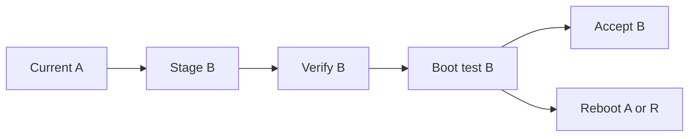

# Boot, redundancy, and recovery contract

**Status:** design target. These procedures must first be demonstrated with disposable VM disks and disposable test data.

## Three independent roles

| Role | Location | Default state | Failure domain |
| --- | --- | --- | --- |
| `JLR-A` / `JLR-B` | Two immutable, signed local boot slots | One active; other is a verified rollback candidate | Same internal disk and firmware path. |
| `JLR-R` | Standalone signed rescue on removable media; optional local convenience copy | Dormant | An external copy can boot when the local disk is lost. |
| `JLR-V` | Encrypted, versioned backup and checkpoint store on another device/off-machine | Receives verified backups | Must use credentials and retention controls unavailable to the ordinary workload. |

The term `JLR-S1` or `SHADOW` may describe a standby image, but a second copy in the same kernel or on the same disk does **not** constitute independent active verification. Initial failover is an authenticated **reboot into a different slot**, not a live handoff of compromised RAM state.

## Boot sequence

1. Firmware selects a JLR boot entry from a configured, controlled trust chain. The exact UEFI signing and revocation procedure is a milestone decision and must be documented with the build.
2. The authenticated boot artifact contains or authenticates the kernel, initrd, image manifest, and expected read-only-root digest. Reject mismatched versions, unknown critical fields, invalid signatures, and rollback below the permitted floor.
3. JLR-S0 starts the root in verified read-only mode, establishes a separate ephemeral writable area, and validates its boot identity and policy before starting services.
4. JLR-G starts in restricted mode. Key release and workload launch wait for the expected boot checks, policy authorization, and a readable ledger checkpoint.
5. Only then does S0 attach permitted virtual devices and launch the workload cell.
6. A boot timeout, crash, or integrity failure stops the workload. The selector tries an allowed verified alternate slot, then enters an explicitly displayed recovery state. Repeated attempts are bounded to avoid a reboot loop.

Verification of a digest requires an authenticated source of the expected digest. Merely marking a partition or SFS `ro` is insufficient. The first implementation may use a whole-image signed digest for small artifacts, then evaluate dm-verity for block reads; it must prove that the boot contract authenticates every root used. TPM measurement is a useful additional witness and key-release condition, not a replacement for signature checking.

## A/B update transaction

The updater writes only the inactive slot and an authenticated next-boot intent. It records build inputs, image digest, signer, policy compatibility, and rollback floor. The candidate must pass a boot health window and a recovery-path check before becoming active. A power cut at any intermediate point must leave either the old verified slot or JLR-R bootable. A rollback policy must distinguish a broken update from a security-mandated minimum version; blindly booting any older signed image can reintroduce a known vulnerability.

The guest must not receive raw access to JLR boot slots or rescue media. Software read-only permissions on a partition are **not** a defense against an adversary who controls the physical disk or the supervising kernel. Protect the installed slots by the boot trust chain and by denying guest device assignment; protect the last-resort copy with independent media.

## Backup and key survival

The backup corpus contains image manifests, policy history, evidence checkpoints, known-good workload base images, and versioned user-data snapshots. Copies should be encrypted before leaving S0, integrity checked after transfer, and retained under a principal that cannot be erased through ordinary workload credentials. Recovery drills must read from the actual secondary device. A snapshot existing only on the protected volume is not an independent backup.

Node identity keys may be hardware generated and TPM bound. **Data recovery must also have a separate authorized key path**: for example, an offline recovery wrapping key or an administrative quorum whose materials can be used on replacement hardware. Define the process to rotate a lost or compromised factor. Never place unwrapped master keys, a recovery phrase, or a private signing key in the image or repository. The backup and the unlock path must survive the same failure scenario being claimed.

Checkpoint the ledger on independent storage or an external verifier. A local append-only file and its own hash chain cannot alone prove it has not been replaced or rolled back. Per-event TPM nonvolatile writes are not assumed; the schedule and durability of checkpoints must be selected and measured.

## Standalone rescue sequence

1. Boot JLR-R from the external verified medium, with the workload stopped. Report which image and policy were authenticated and whether the time/ledger context is complete.
2. Enumerate storage without executing anything from the damaged volume. Identify candidate partitions, filesystem types, encryption metadata, and signs of physical failure.
3. Mount source media read-only where possible; do not replay a journal or run a repair tool against the source merely to inspect it. If inspection is risky, acquire a copy to a separate destination first.
4. Obtain the relevant recovery factor and validate the selected manifest, snapshot contents, and available independent checkpoint. Present an inventory and uncertainty before any write.
5. **File export path:** copy selected files to a separate destination, verify copied bytes and metadata, label unverifiable or suspicious objects, and produce a receipt. This path works even if a full system restore is inappropriate.
6. **System rebuild path:** preserve evidence and current disk state, create a new known-good workload image, re-admit executables and configuration, restore selected user data, rotate exposed secrets, and verify boot. Obtain explicit recovery authority before replacing or formatting a source volume.
7. Retain an isolation/rollback route if verification or the replacement boot fails. Close with a signed report covering source, destination, missing evidence, and actions taken.

Recovery has both an **inspection-only mode** and a **write-enabled restoration mode**. The former is the default. A headless machine may use a pre-signed, narrowly scoped recovery policy; it must include a preview/receipt and an escape path. Local emergency authorization needs an explicit operator action and an independent factor. No workflow should imply that damaged user data is necessarily authentic because it can be decrypted.

## Representative acceptance drills

| Fault injected in disposable VM | Expected outcome |
| --- | --- |
| Delete workload kernel and bootloader | JLR-R boots, identifies and exports a known test file. |
| Corrupt active JLR slot | Selector uses verified alternate slot or recovery; workload remains stopped until checks pass. |
| Corrupt both local slots | External JLR-R boots without reading local slots. |
| Erase local disk | External JLR-R plus separate backup and recovery factor rebuild a test file on replacement disk. |
| Lose TPM state | Offline authorized factor unlocks backup on a replacement VM; inability is documented if no factor was enrolled. |
| Tamper with backup or replay older checkpoint | Verification fails or explicitly reports a rollback gap; no silent restore. |
| Power cut during inactive-slot update | At least one permitted signed boot path remains available. |
| Restore a malicious executable present in a snapshot | Executable is quarantined pending fresh admission, not automatically run. |

Only the tests actually completed may appear as achieved recovery claims in a release. See [Implementation plan](IMPLEMENTATION-PLAN.md) for the order in which they become gates.
