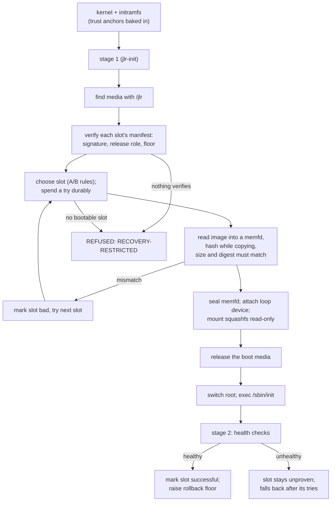

# Boot and Installation

## 1. The JLR-first principle

The preferred architecture installs JLR **before** the governed Linux system: JLR owns an independent boot and recovery
substrate, verifies its own base, and only then hands off. That makes JLR the persistent governance layer rather than an
application installed after the host.

**What exists.** The verified boot chain, the RAM-resident base, the A/B state machine with a rollback floor, reproducible
image builds, and a QEMU/KVM test suite that boots the real initramfs. **What does not exist yet:** firmware
authentication of the initramfs (Secure Boot and a unified kernel image), TPM anchoring, and the installer that lays out a
disk and registers a host. Each is specified below and none is claimed.

## 2. The boot chain as implemented



| Check | Where | If it fails |
|---|---|---|
| Trust anchors present and non-empty | initramfs | `REFUSED` |
| Manifest signature, release role, `epoch >= floor`, `min_epoch <= epoch` | stage 1, per slot | Slot not considered; logged |
| Boot attempt recorded | stage 1, before the image is used | `REFUSED` (cannot record) |
| Image size equals the manifest, digest equals the manifest | stage 1, while copying into RAM | Slot marked bad; next slot |
| Sealing, loop attach, mount | stage 1 | `REFUSED` |
| Root is read-only; run is writable and memory-backed; manifest present; tools present | stage 2 | Slot stays unproven |

After a refusal **nothing from the media has been executed**: the console reports `state=RECOVERY-RESTRICTED` and the
machine waits (or powers off or reboots, per `jlr.onfail`). The independent recovery path is a separate boot medium.

## 3. Media and image layout

```text
/jlr/bootstate.cbor                floor + per-slot {priority, tries, successful}
/jlr/slot-a/manifest.cose          signed ReleaseManifest
/jlr/slot-a/base.sqfs              the read-only base image
/jlr/slot-b/...
```

The boot media is ext4 (or vfat or iso9660, read-only) and needs no special handling: nothing on it is trusted until verified.
The **base image** is a zstd squashfs containing BusyBox, `jlr`, `jlrd`, `jlr-cell-init`, `jlr-release` and `jlr-init` as
`/sbin/init`, all static musl. The **initramfs** contains `jlr-init` as `/init` and `etc/jlr/anchors.cbor`, the release
public key(s) the boot will accept.

## 4. A/B slots, the rollback floor, and update safety

The rules follow ChromeOS's slot triple because they need nothing from a possibly broken running system:

- a slot is bootable if it verified **and** is either `successful` or has `tries > 0`;
- the bootable slot with the highest `priority` is chosen; ties break by name;
- before booting an unproven slot, its `tries` is decremented **and written durably**, so a crash or power cut during boot
  consumes a try and the next boot falls back;
- only after stage 2's health checks does the slot become `successful` and the **floor** rise to the release's
  `min_epoch`. Raising it earlier would let a bad update strand a machine with no bootable slot;
- installing a new release gives it maximum priority and demotes the previous one, so the update is tried first but the
  previous proven slot stays the fallback;
- a slot whose image fails is marked bad (priority 0) and is never tried again.

Every one of these is a QEMU scenario: valid boot; tampered image; truncated image; tampered manifest; unknown signer;
right key with the wrong record type; rollback below the floor; a broken update falling back to the proven slot; a good
update proving itself and raising the floor, after which the old slot is refused as a rollback on the next boot; missing
media; media without `/jlr`. A companion set of property tests covers the selection function over generated states.

**Rollback.** A validly signed old release is refused once the floor has risen. That is what stops an attacker reinstalling
a known-vulnerable signed image.

## 5. RAM residency

The verified image is held in a sealed `memfd`, mounted through a loop device, and the boot media is **released** before the
system runs. The point is not speed:

- there is no window between verification and use in which the media could change the bytes, because the mounted bytes
  *are* the verified copy;
- a reboot returns to a known state, and replacing the base is atomic;
- the base cannot be written (read-only mount over a sealed, immutable backing store);
- the machine does not depend on the boot media staying attached.

The cost is RAM equal to the image size (about 4 MB today). "RAM-resident" does **not** mean "persistence-free": policy, keys,
the ledger and backups live on explicit persistent storage, mounted after the base is verified (ADR-003).

## 6. Console protocol

Stage 1 and stage 2 print `JLR-BOOT:` and `JLR-STAGE2:` lines that the test suite asserts against; see
[CLI_REFERENCE.md](CLI_REFERENCE.md). Boot also announces its own assurance:

```text
JLR-BOOT: start assurance=prototype (no Secure Boot or TPM anchor: the initramfs itself is not authenticated)
```

## 7. Reproducible build

```sh
boot/build.sh
```

builds the static musl binaries, a BusyBox-based root, a deterministic squashfs (`-reproducible`, no xattrs, all-root,
`SOURCE_DATE_EPOCH`), and the initramfs with a small deterministic newc writer (`boot/mkcpio.py`). Two builds give
identical `base.sqfs` and `initramfs.cpio.gz`; CI builds twice and compares. The build prints the SHA-256 of every artifact.

The test keys are generated by the build and are **not** release keys. A release signs its manifest on a separate,
preferably offline machine with `jlr-release manifest`, and the initramfs embeds only the *public* key.

## 8. The substrate decision (Puppy Linux)

The owner delegated the choice among Puppy variants. **Decision: the trusted base is built from a pinned set of static
binaries and BusyBox, not from a Puppy distribution.** Puppy's *concepts* are used (a compressed read-only image loaded
into RAM behind a small initramfs); its code is not.

Reasons:

- **Trusted computing base.** The base image is about 4 MB and contains about 15,000 lines of first-party Rust plus BusyBox.
  A Puppy-derived base starts at hundreds of megabytes of desktop software that would then have to be removed and
  re-justified package by package.
- **Reproducibility.** The whole base is rebuilt bit-for-bit in about a minute from pinned inputs. Woof-CE builds are not,
  to our knowledge, designed to give reproducible output, and Puppy variants track several different upstream
  distributions; both points come from general knowledge and were **not** verified in this project, so check them before
  relying on them.
- **No mutation channel.** Puppy's package and save-file mechanisms exist to make the system change itself. The governance
  base must not.
- **Headless.** Nothing in governance needs a desktop.

What Puppy is still good for is the **recovery environment**, where a person wants file managers, partition tools and
familiar utilities on unfamiliar hardware. If a graphical rescue image is built, a heavily reduced Woof-CE lineage is the
candidate, subject to a pinned-source and per-package licence inventory before release. That is a later, separate decision.

## 9. Secure Boot, unified kernel image and TPM (designed)

This closes the largest gap in the trust argument: today the initramfs, and therefore the trust anchors, are not
authenticated by firmware.

1. Build a **unified kernel image**: kernel, initramfs and command line as one signed PE binary (systemd-stub, `ukify`),
   signed with the operator's own Secure Boot key (`sbsign` / `sbctl`), enrolled in firmware. Firmware then authenticates
   the anchors.
2. **Rollback floor in a TPM NV counter**, not on the media. TCG's NV counter semantics mean a deleted and re-created
   counter starts above any value the TPM ever held.
3. **Measured boot:** extend PCRs with the manifest and image digests; seal disk and state keys to that state, with an
   enrolled recovery key so a firmware update cannot lock the owner out.
4. Checkpoints gain an `anchor = Tpm` counter.
5. Tests: QEMU with OVMF (Secure Boot variables enrolled) and `swtpm`, both already available in the build image.

`dm-verity` per-read verification is the right tool for a large on-disk base; for a RAM-resident base the whole-image hash
already covers every byte before use, so it is not needed here.

## 10. Host installation and handoff (designed)

1. Install JLR, its boot slots and recovery partition; enrol trust anchors.
2. Install the host Linux into a **separate target** the installer can see, with no write access to JLR's partitions.
3. Register the host's boot artifacts (kernel, initramfs, bootloader configuration); measure them; admit the initial host
   state through a baseline the operator signs.
4. Boot the host through JLR policy. A modified host boot set produces a degraded posture, not a silent boot.

Suggested layout:

```text
EFI-SYSTEM   FAT32   firmware boot files
JLR-BOOT     ext4    /jlr slots and bootstate (verified before use)
JLR-STATE    LUKS    keys, policy, ledger (encrypted, mounted after the base is verified)
JLR-RECOVERY ext4    an independent recovery slot
HOST-ROOT    host Linux
HOST-DATA    user data
```

**Encryption.** Sensitive persistent JLR state should be authenticated-encrypted, with keys operator-entered,
token-protected, TPM-sealed, or split between machine and operator. Encryption does not replace integrity verification.

**Direct or as a guest.** The host can run on JLR's kernel governed by the exec gate (and, where the kernel has them, IPE
and fs-verity), or later as a KVM guest for a stronger boundary. Records and protocols are the same either way
(ADR-014).
