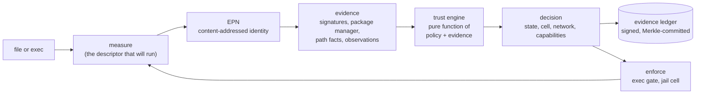

# JLR in one page

**JLR is a governance layer for a Linux machine.** It decides, continuously and on its own, what software is
allowed to run, with what authority, and whether the machine's own trust anchors still match what was
established when it was set up. It keeps a tamper-evident record of every decision and can boot independently of the
system it governs. It is more than an antivirus, because it does not guess about behaviour: it works from identity,
provenance and policy. It is more than an encryption layer, because confidentiality of data at rest is one property
among many it depends on, not the goal.

The person using the machine should rarely notice it. Almost everything JLR does needs no answer from them.

## The loop

1. **Measure.** A file is hashed through the very file descriptor that will be executed, so a path swapped afterwards
   changes nothing.
2. **Identify.** The bytes, class, name, source and provenance form an *EPN record*. Its identifier is the SHA-256 of
   that record, so anyone can recompute and check it. It contains no timestamp and no mutable state.
3. **Weigh evidence.** Signatures, package-manager ownership, whether the file matches its manifest, setuid bits, whether
   an attacker could write the path, and what an observation cell saw.
4. **Decide.** A deterministic function of the signed policy and the evidence returns a state, a jail cell, a network
   mode and an exact capability set. Revocation always wins. Missing evidence never promotes.
5. **Record.** Every state change is a signed event in an append-only ledger whose head is committed by signed
   checkpoints. The event names the evidence and whether the basis was cryptographic, policy, or a human override.
6. **Enforce.** The exec gate refuses to start what may not run; cells confine what may run only under restrictions.

## What the user sees

| Situation | What happens | Human involved |
|---|---|---|
| Software arrives through the distribution's signed package channel | Admitted silently into a normal cell | No |
| Software carries a pinned vendor signature | Admitted silently | No |
| An unknown program is launched | Runs only in an isolated observation cell with no network and no access to the user's files | No, until it needs more |
| An enrolled program's bytes change | Its old identity is degraded and the new bytes are treated as unknown | No |
| Software asks for a high-risk capability (kernel modules, raw network, raw block writes, host service control, raw USB) | Withheld; the request is queued | **Yes** |
| A revoked or policy-blocked program is started | Denied | No |
| The boot chain, policy signature or ledger fails verification | Boot refuses to start the base and says why; policy is refused, never replaced by a default | **Yes** |
| Enforcement is switched on, or a key is rotated | A signed, logged policy epoch | **Yes** |

The decisions that always stay with a person are exactly those that raise authority beyond what evidence supports,
change the rules, or touch keys.

## Assurance labels

Every status report says what it can honestly claim. There is no "unhackable" tier.

| Label | Meaning | Today |
|---|---|---|
| `prototype` | Evidence comes only from an emulator or test harness | Boot chain and exec gate are exercised under QEMU/KVM |
| `companion` | JLR runs beside the host on the host kernel. Host root can subvert it | **Implemented**: CLI, engine, cells, ledger, `jlrd` |
| `supervisor` | JLR boots first from verified media and governs the host as a workload | Verified boot and RAM-resident base **implemented**; the host-as-workload handoff is designed |
| `recovery` | A separately booted rescue environment | Designed; the boot chain it needs exists |

## What JLR is not

- Not a malware oracle. It does not decide whether code is *benevolent*; it decides whether code is *identified,
  provenanced and permitted*, and confines it accordingly.
- Not a hypervisor. It may use a VM as a stronger cell later, but its job is governance, not virtualisation.
- Not a substitute for backups, secure development, or protecting the offline keys.
- Not resistant to a compromised firmware, CPU, or a kernel it depends on. Cells share the host kernel.

The precise limits are in [SECURITY_BOUNDARIES.md](SECURITY_BOUNDARIES.md) and the adversary model is in
[THREAT_MODEL.md](THREAT_MODEL.md).

## Where to go next

- To run it: [OPERATIONS.md](OPERATIONS.md) and [CLI_REFERENCE.md](CLI_REFERENCE.md).
- To understand it: [ARCHITECTURE.md](ARCHITECTURE.md), then [TRUST_MODEL.md](TRUST_MODEL.md).
- To change it: [DEVELOPMENT.md](DEVELOPMENT.md) and [DECISIONS.md](DECISIONS.md).
