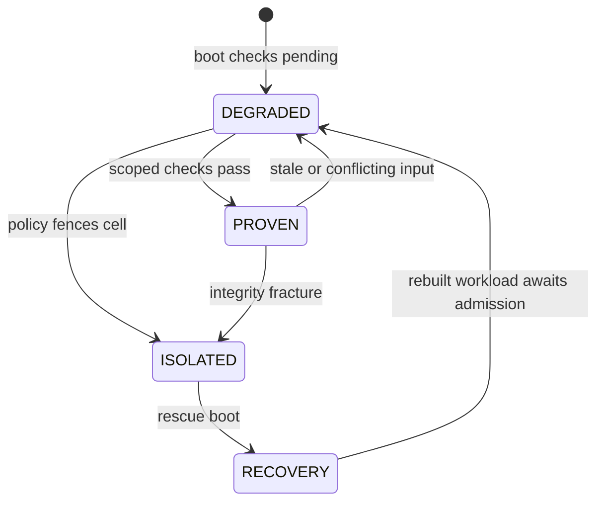

# State, evidence, and authority protocol

**Status:** interface design. Examples are illustrative schemas, not production test vectors or a finalized wire encoding.

## Common envelope

Every signed record has a `format_version`, `record_type`, `issuer_id`, `boot_id`, `sequence`, `previous_digest` where applicable, `created_at` as advisory metadata, `payload_digest`, and `signature`. Implementations must choose and publish one deterministic byte encoding, exact domain separation and signature algorithm, reject duplicate/unknown critical fields, and verify on the **raw canonical bytes** before acting. Cross-protocol reuse of a signature is forbidden. Exact test vectors, upgrade handling, and algorithm agility are M1 deliverables.

Use monotonic sequence numbers within a boot epoch; bind continuity across boots through independently checked ledger checkpoints. A timestamp alone does not prevent replay. The verifier must reject stale or wrong-node records, gapful streams where continuity is required, unknown signers, and a policy digest different from the one that made the decision.

## Admission: JLR-EPN

An EPN is a versioned **artifact admission record**, not a proof that its subject is benign. It must contain:

| Field | Meaning |
| --- | --- |
| `artifact_digest`, `algorithm`, `size`, `artifact_type` | Exact subject bytes and how they were measured. |
| `build_identity`, `source_refs`, `signer_chain` | Available provenance with its own validation result; missing provenance is explicit. |
| `dependency_digests` | Exact dependencies necessary for an admission decision, or a declared scope limit. |
| `policy_digest`, `profile_id`, `node_scope` | Policy and context under which admission was evaluated. |
| `outcome`, `reason_codes`, `valid_from`, `valid_until` | `ADMITTED`, `DENIED`, or `UNRESOLVED`; reason, time window, and revocation checks. |

The record ID is a digest of its versioned content. Two identical binaries may have different admissions under different policies. A positive EPN result is valid only while its dependency set, policy, boot context, and revocation status remain acceptable. Reusing an EPN after a dependent artifact changes requires a new admission decision. The expansion of the acronym EPN has not been chosen.

## Scoped system integrity receipt: JLR-SIR

A SIR is a signed receipt for a **defined observation scope**, such as an S0 boot image plus the manifests and devices visible at a checkpoint. Its payload contains `scope`, `coverage`, `missing_inputs`, `algorithm`, component roots, `policy_digest`, `image_digest`, `epoch`, `boot_id`, `ledger_head`, and `result`. A root commits to the bytes in its named inventory, including ordering and types; an omitted sensor or mutable object must be reported in `missing_inputs` rather than assumed clean.

```json
{
  "format_version": 1,
  "record_type": "jlr.sir",
  "boot_id": "illustrative-boot-id",
  "epoch": 48199,
  "scope": ["s0.boot", "cell.alpha.virtual_disk", "policy.active"],
  "coverage": ["s0-image-digest", "virtual-disk-snapshot-root", "policy-digest"],
  "missing_inputs": ["cell.alpha.guest-memory"],
  "component_roots": {"software": "sha256:...", "storage": "sha256:...", "policy": "sha256:..."},
  "ledger_head": "sha256:...",
  "result": "DEGRADED"
}
```

`SIR = H(domain || version || canonical scoped payload)` is an identifier/commitment, **not an encryption key and not evidence that all physical memory was scanned**. Both the hash algorithm and canonicalization rules must be fixed in a versioned spec before interoperability is claimed. Software-controlled counters alone are not hardware monotonic counters.

## JIP: integrity pulse receipt

A JIP records an event-triggered or scheduled evaluation: pulse sequence, covered sensor windows, events ingested, targeted checks, challenge seed provenance, policy result, elapsed time, and resulting SIR reference or missing coverage. Pulses may be frequent, but their frequency is a measurable service objective, not a correctness assumption. Random challenges are an additional sampling control, not a substitute for event enforcement. Detection latency and missed-event rate must be measured under load.

## Authority lease

An authority lease binds `subject`, `operation`, `object`, `cell`, `policy_digest`, `required_evidence`, `epoch`, `expiry`, and an unguessable request identifier to a signed decision. The default is deny. A grant is single-purpose and short lived; revocation is checked at the enforcement point. If a required observation plane is lost, the dependent leases expire or are revoked according to the named policy. A lease cannot give the workload a raw device path to the rescue partition or a master key.

For keys, JLR-G authorizes a narrowly scoped request and the broker uses a hardware or protected wrapping boundary when available. Key requests and denials go into the ledger. Rotating a compromised key changes the relevant dependencies and invalidates admissions that require it. Claims about zeroization are limited by copies outside JLR's control, swap, DMA, and the actual cryptographic library implementation.

## State transitions



`PROVEN` is always scoped: a verified boot image does not prove a live guest's memory or personal files. An unauthorized transition with a failed integrity check is recorded as `INTEGRITY_FRACTURE` with evidence pointers. Contradictory evidence initially yields `DEGRADED` unless a policy can identify a specific unauthorized transition. The system never promotes `DEGRADED` to `PROVEN` merely because a timeout elapsed.

## Ledger and checkpoint

The ledger stores decisions and evidence references in a sequenced, hash-linked stream. Each event includes its subject/object scope, sensor origin, boot/epoch identity, observation window, previous digest, and outcome. A periodic signed checkpoint commits the current head to a destination outside the workload's ordinary write authority. A verifier checks both internal hash continuity **and** the independently retained checkpoint; otherwise deletion of the entire local chain could go unnoticed. Logs may omit private payloads while retaining typed content digests and access-controlled evidence pointers.

## Cross-view reconciliation

XVD may compare a guest report of a virtual disk write or egress attempt against an S0 record over an explicitly synchronized window. It cannot compare “no executable mapping” against an S0 block trace and conclude a mapping must not exist. Each XVD rule declares the same observable proposition on both sides, clock/skew tolerance, missing-data behavior, and a test fixture that demonstrates false positive handling. A disagreement records both original observations, then restricts authority only as authorized by the rule's policy.

## Wire-protocol safety requirements

- Mutating requests are authenticated, authorized, bounded in size, versioned, and idempotent by request ID.
- A management channel and the in-guest telemetry channel use different credentials and permissions.
- An unavailable ledger/checkpoint dependency prevents sensitive grants when policy requires recording; local recovery remains accessible.
- A parser failure is an explicit failure result; it cannot fall through to an allow decision.
- Protocol test suites include malformed inputs, old versions, replayed signatures, duplicate keys, sequence gaps, and wrong-node or wrong-profile requests.
